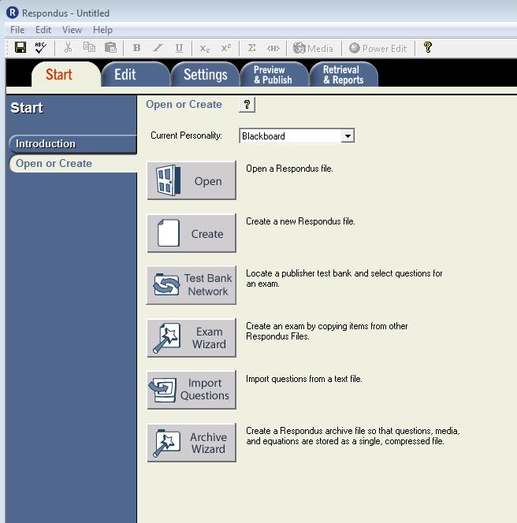
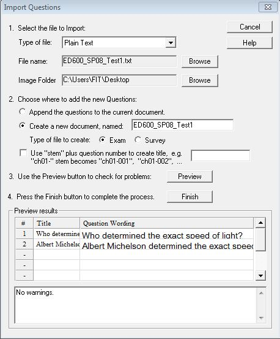

# Import the Test

Once you have finished formatting your document, you can save and import it straight into Respondus.

1. Launch Respondus

1. Click the **Start** tab
2. Click on **Import Questions**
3. Select the type of file to be imported \(txt, doc, docx\)
4. Click **Browse** next to “File name” to locate file
5. Click **Open**
6. Type a name in “Create new document” \(e.g. YourInitials\_Test1\_Summer2016\)
7. Select **Exam** for “Type of file”
8. Click **Preview** \(required\)

1. Check for warnings. In the case you get a duplicate question title warning, you can ignore it and continue to the next step.
2. Click **Finish**

