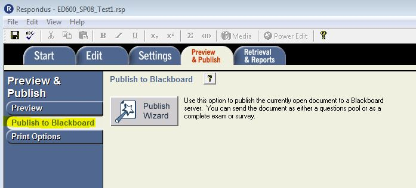
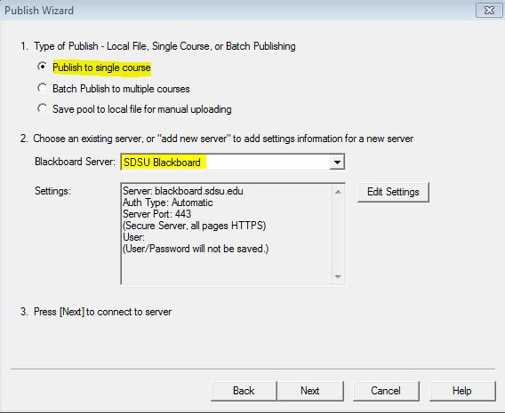
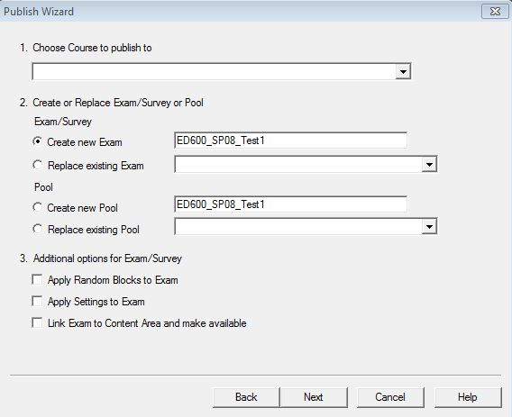
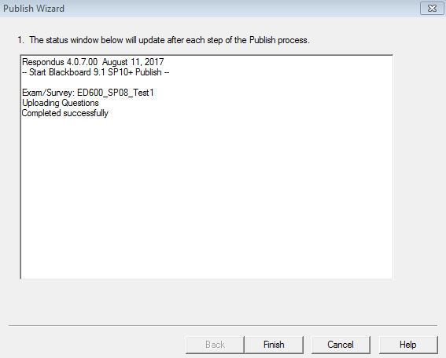

# Publish to Blackboard

> NOTE: If you are NOT using Respondus in SDSU’s FIT Center, please connect Respondus to the Blackboard server prior to completing this procedure.

In this final step, you will connect to Blackboard by selecting the server and entering your Blackboard username and password.

1. Click the **Preview** & **Publish** tab

1. Click **Publish** **to** **Blackboard**
2. Click **Publish** **Wizard**

1. Choose Publish to single course
2. Select the server \(Blackboard@SDSU\)
3. Click **Next**
4. Click the drop-down menu to choose the course.
5. Verify the exam name. Change it if desired so that you will recognize it in Blackboard.

1. Deselect all additional options if you are not using Random Blocks.
2. Click **Next**.
3. Wait for the message, “Completed successfully” to appear

1. Click **Finish **and close Respondus

## Now What?

Now you can deploy the test in Blackboard as you would with any Blackboard test or survey. Once published to Blackboard, the test resides in the Test manager \(Control Panel =&gt; Course Tools =&gt; Tests, Surveys and Pools\). You can edit the test or set your test options just like any other Blackboard test.

